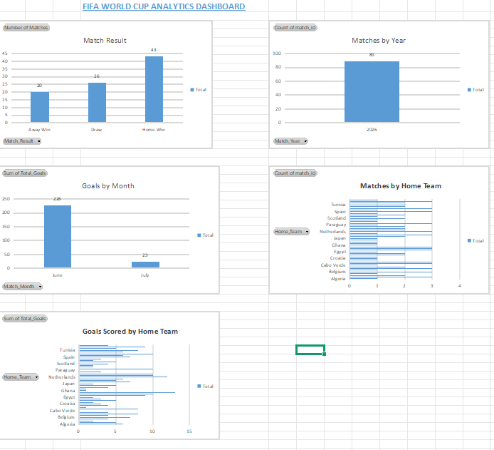
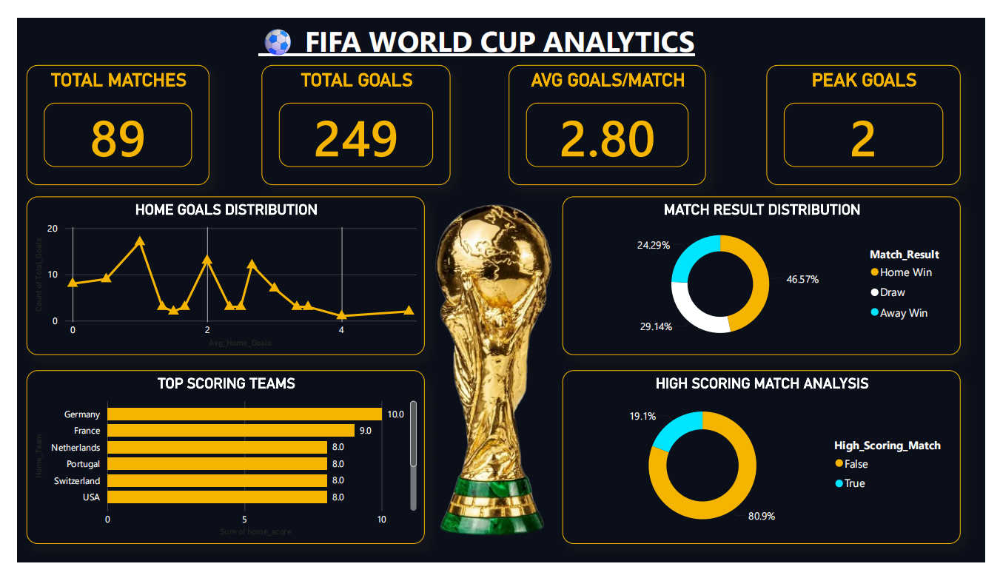
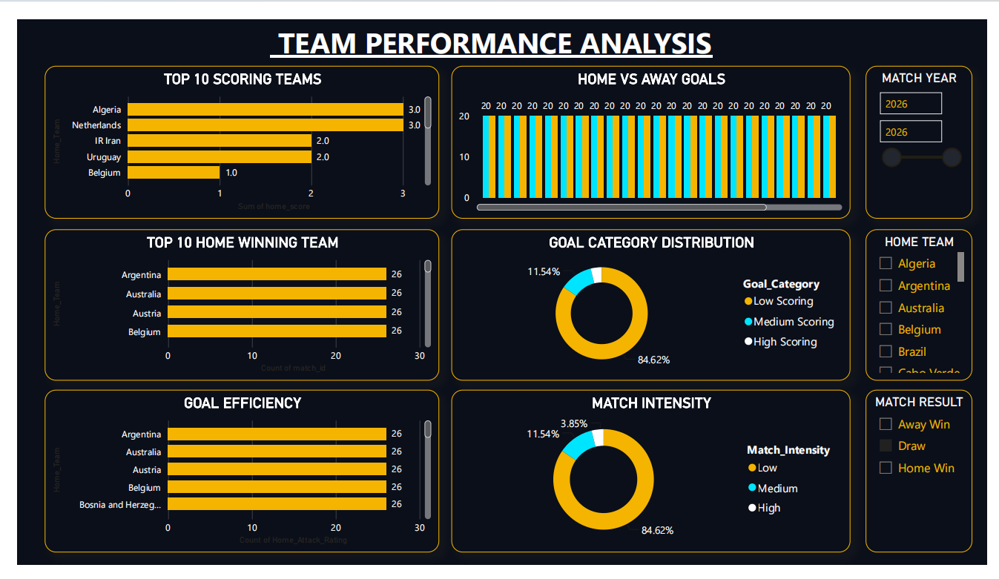
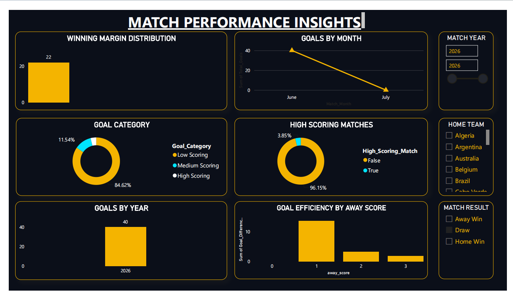

# ⚽ Football World Cup Analytics

## 📌 Project Overview

The Football World Cup Analytics project is an end-to-end data analytics project that analyses FIFA World Cup football match data using Microsoft Excel, Python, SQL Server, and Power BI.

This project demonstrates the complete analytics workflow from raw data collection, data cleaning, feature engineering, SQL analysis, dashboard development, and visualisation to GitHub project deployment.

---

# 🎯 Project Objectives

- Analyse football World Cup match statistics.
- Compare team performances.
- Identify top scoring and winning teams.
- Analyse home and away goal patterns.
- Understand match intensity and goal categories.
- Build interactive dashboards for business insights.
- Demonstrate an end-to-end Data Analytics workflow.

---

# 🛠️ Tools & Technologies

| Tool | Purpose |
|-------|----------|
| Microsoft Excel | Data Exploration, Pivot Tables, Dashboard Creation |
| Python (Pandas, NumPy, Matplotlib) | Data Cleaning & Feature Engineering |
| SQL Server | Data Analysis using SQL Queries |
| Power BI | Interactive Dashboard Development |
| Git & GitHub | Version Control and Project Hosting |

---

# 📂 Project Workflow

## 1️⃣ Data Collection
- Imported the raw FIFA World Cup dataset.
- Reviewed dataset structure and columns.

## 2️⃣ Data Exploration & Dashboard (Microsoft Excel)
- Explored the dataset.
- Created Pivot Tables.
- Created Pivot Charts.
- Built an interactive Excel Dashboard using KPIs and Slicers.

## 3️⃣ Data Cleaning & Feature Engineering (Python)
Performed data preprocessing, including:
- Handling missing values
- Removing duplicates
- Correcting data types
- Feature engineering
- Exporting cleaned dataset

Created new analytical columns such as:
- Goal Difference
- Match Result
- Goal Category
- Match Intensity
- Winning Margin
- Home Goal Efficiency
- Away Goal Efficiency
- Home Attack Rating
- Away Attack Rating
- Home Defense Rating
- Away Defense Rating
- Total Goals
- Average Goals Per Match

## 4️⃣ SQL Analysis
Performed SQL analysis to identify:
- Top Scoring Teams
- Top Winning Teams
- Goal Statistics
- Match Result Distribution
- Home vs Away Performance
- Team Performance Analysis

## 5️⃣ Interactive Dashboard Development (Power BI)

Designed three professional dashboards:

### Executive Dashboard
- Total Matches
- Total Goals
- Average Goals per Match
- Peak Goals
- Home Goal Distribution
- Match Result Distribution
- High Scoring Match Analysis

### Team Performance Dashboard
- Top Scoring Teams
- Top Winning Teams
- Home vs Away Goals
- Goal Category Distribution
- Match Intensity Analysis

### Match Insights Dashboard
- Monthly Match Trends
- Winning Margin Analysis
- Goals by Year
- Venue Analysis
- Referee Analysis
- Goal Efficiency Comparison

## 6️⃣ GitHub Documentation
- Organised project files into folders.
- Uploaded project to GitHub.
- Added documentation and project structure.

---
## 📊 Dashboard Preview

## Excel Dashboard



## PowerBI Dashboard 1



## PowerBI Dashboard 2



## PowerBI Dashboard 3



# 📊 Dashboard Pages

### 📌 Excel Dashboard
- KPI Cards
- Pivot Charts
- Interactive Slicers

### 📌 Power BI Dashboard 1
**Executive Dashboard**
- Total Matches
- Total Goals
- Average Goals
- Peak Goals
- Match Result Analysis

### 📌 Power BI Dashboard 2
**Team Performance Analysis**
- Top Scoring Teams
- Top Winning Teams
- Home vs Away Goals
- Goal Category Distribution
- Match Intensity

### 📌 Power BI Dashboard 3
**Match Insights Dashboard**
- Monthly Trends
- Winning Margin
- Goals by Year
- Venue Analysis
- Referee Analysis

---

# 📈 Key Insights

- Germany scored the highest number of goals.
- Home teams won more matches than away teams.
- Most matches were low to medium-scoring.
- Average goals per match remained around 2–3 goals.
- High-scoring matches represented a smaller portion of total matches.
- Goal distribution varied across different tournaments and teams.

---

## 📁 Project Structure

Football-World-Cup-Analytics

├── Data
│ ├── Raw_Data
│ └── Clean_Data
│
├── Excel
│ ├── Excel Dashboard.xlsx
│ └── Football_World_Cup_Analytics.xlsx
│
├── Python
│ └── Football_Analytics.ipynb
│
├── SQL
│ └── Football SQL Queries.sql
│
├── PowerBI
│ └── Football Dashboard.pbix
│
├── Images
│ ├── Executive_Dashboard.png
│ ├── Team_Performance.png
│ └── Match_Insights.png
│
└── Documentation
```

---

# ▶️ How to Run the Project

1. Download the repository.
2. Open the Excel dashboard.
3. Run the Python notebook.
4. Execute SQL scripts in SQL Server.
5. Open the Power BI (.pbix) file.
6. Explore the dashboards and insights.

---

# 📷 Project Screenshots

Project screenshots are available in the **Images** folder.

- Excel Dashboard
- Executive Dashboard
- Team Performance Dashboard
- Match Insights Dashboard

---

# 👩‍💻 Author

Nandni Kumari

📧 Data Analytics Enthusiast

GitHub:
https://github.com/nandnikumari2309

---
